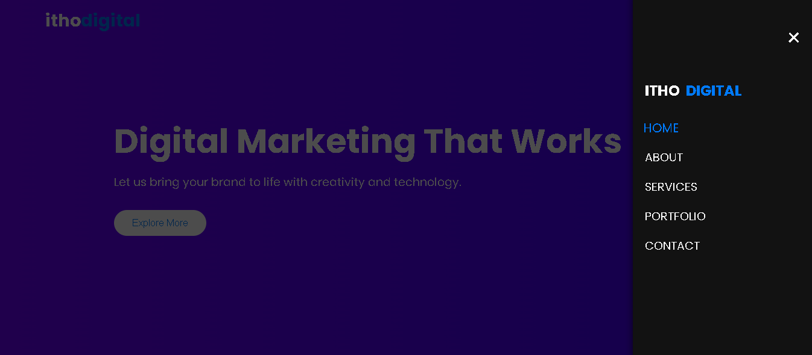

# **Stylish Off-Canvas Menu Project** 🎨

Welcome to the **Stylish Off-Canvas Menu Project**! This project is a sleek and modern implementation of a fully functional **off-canvas navigation menu** with smooth animations, responsive design, and customizable styles. Perfect for websites that need a professional and interactive navigation experience. 🚀

## **Table of Contents** 📚

- [**Stylish Off-Canvas Menu Project** 🎨](#stylish-off-canvas-menu-project-)
  - [**Table of Contents** 📚](#table-of-contents-)
  - [**Project Overview** 📖](#project-overview-)
  - [**Features** ✨](#features-)
  - [**Technologies Used** 🛠️](#technologies-used-️)
  - [**How to Use** ⚙️](#how-to-use-️)
  - [**Folder Structure** 📁](#folder-structure-)
  - [**Live Demo** 🌐](#live-demo-)
  - [**Screenshots** 📸](#screenshots-)
    - [**Desktop View** 🖥️](#desktop-view-️)
    - [**Mobile View** 📱](#mobile-view-)
  - [**Future Improvements** 🌱](#future-improvements-)
  - [**Contributing** 🤝](#contributing-)
  - [**License** 📄](#license-)

## **Project Overview** 📖

This project showcases:
- 🌟 A clean and professional **off-canvas menu** for navigation.
- 📱 Fully **responsive design** for desktop and mobile devices.
- 🔄 Smooth **animations** for opening and closing the menu.
- 🎨 Elegant **UI styling** with attention to typography and layout.

Whether you're creating a business website, portfolio, or a landing page, this project is the perfect starting point! 🖥️

## **Features** ✨

- ✅ **Off-Canvas Navigation Menu**  
  🚪 A stylish menu that slides in from the right with a close button and overlay.  

- 📱 **Responsive Design**  
  🌟 Adapts seamlessly to desktop and mobile devices.  

- 🎥 **Smooth Animations**  
  ✨ Subtle animations for transitions, hover effects, and button clicks.  

- 🎨 **Customizable Styles**  
  🎭 Easy-to-edit HTML, CSS, and JavaScript for your own branding.  

- 🎯 **Left-Aligned Navigation Items**  
  🔗 Ensures navigation links are aligned to the left for a polished look.  


## **Technologies Used** 🛠️

- 🌐 **HTML5**: Structure of the project.  
- 🎨 **CSS3**: Styling, animations, and responsive design.  
- 🖱️ **JavaScript**: Adding functionality and interactivity.  
- ✍️ **Google Fonts**: Clean and modern typography using **Poppins**.  
- 🖌️ **Font Awesome**: Icons for menu interactions.  

## **How to Use** ⚙️

Follow these steps to use and customize the project:

1. **Clone the Repository** 🖥️  
   ```bash
   git clone https://github.com/HashimThePassionate/offcanvas-menu.git
   cd offcanvas-menu
   ```

2. **Open in Your Browser** 🌐  
   - Open `index.html` in your favorite browser.

3. **Customize the Menu** 🎨  
   - Modify the **HTML structure** in `index.html` to add or remove menu items.  
   - Change colors, fonts, or animations in `css/styles.css`.

4. **Add to Your Website** 🚀  
   - Integrate the `index.html`, `styles.css`, and `script.js` into your project.

## **Folder Structure** 📁

```
offcanvas-menu/
│
├── index.html        # Main HTML file
├── css/
│   └── styles.css    # Styling for the project
└── js/
    └── script.js     # JavaScript functionality
```

## **Live Demo** 🌐

👉 [Check out the live demo](#) (Add the GitHub Pages link after deployment).  

---

## **Screenshots** 📸

### **Desktop View** 🖥️


### **Mobile View** 📱


---

## **Future Improvements** 🌱

Here are some ideas for enhancing the project:

- 🌑 Add a **dark mode toggle** for the menu.  
- 📂 Implement **sub-menu support** for navigation.  
- 🎥 Enhance animations for a more dynamic feel.  
- ✅ Add **ARIA roles** for better accessibility.  

---

## **Contributing** 🤝

We welcome contributions! To contribute:  

1. 🍴 **Fork the repository**.  
2. 🌿 **Create a new branch**:  
   ```bash
   git checkout -b feature-name
   ```
3. 💡 **Commit your changes**:  
   ```bash
   git commit -m 'Add some feature'
   ```
4. 📤 **Push to the branch**:  
   ```bash
   git push origin feature-name
   ```
5. ✅ **Open a Pull Request**.  

---

## **License** 📄

This project is licensed under the **[MIT License!](./LICENSE)**. Feel free to use and modify it for personal or commercial projects. 🎉  

---

Start building **modern, stylish websites** with this **Stylish Off-Canvas Menu Project**! 🌟 Don't forget to give it a ⭐ on GitHub if you like it!  

